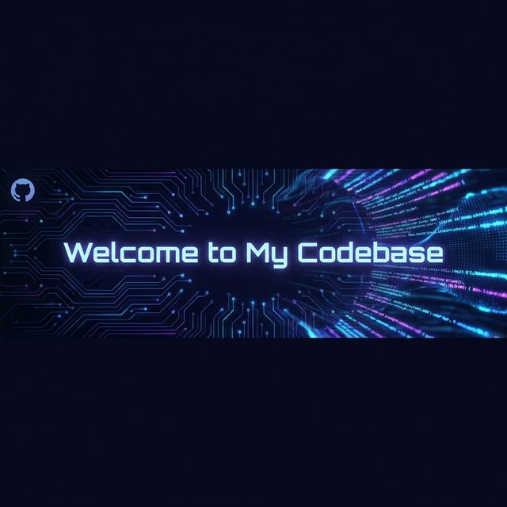

  

<h1 align="center">Hi there, I'm <a href="https://github.com/23f2005121">Azhaan Pary</a>! </h1>

  I am a <b>Data Science</b> and <b>Information Engineering</b> student at the <b>Indian Institute of Technology (IIT) Madras</b> and <b>Technical University of Munich (TUM)</b>, passionate about turning raw data into meaningful insights and building robust applications. I bridge the gap between analytical engineering and creative development, exploring everything from <b>Machine Learning</b> models to immersive <b>Game Development</b>.

  

  
  

---

### 🛠️ Tech Stack & Tools

  <!-- Data Science & ML -->
  
   
  <!-- App Dev -->
  

---

### 🚀 Areas of Focus

- **Data Science & AI**: Leveraging Python, TensorFlow, and PyTorch to build predictive models and analyze complex datasets.
- **Game Development**: Creating immersive gaming experiences with LibGDX (Java), focusing on audio design and gameplay mechanics.
- **Full Stack Web**: Building scalable web applications using Flask and modern frontend technologies.

---

  <i>"Data is the new oil. It’s valuable, but if unrefined it cannot really be used." – Clive Humby</i>

